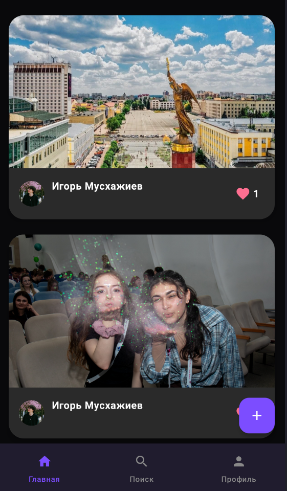
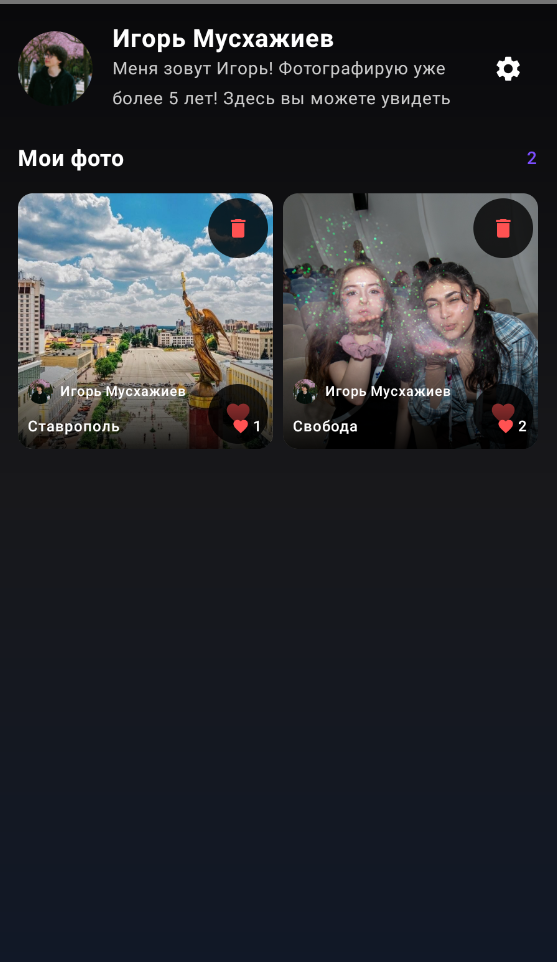
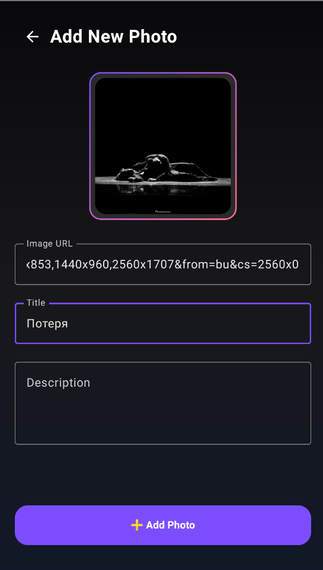
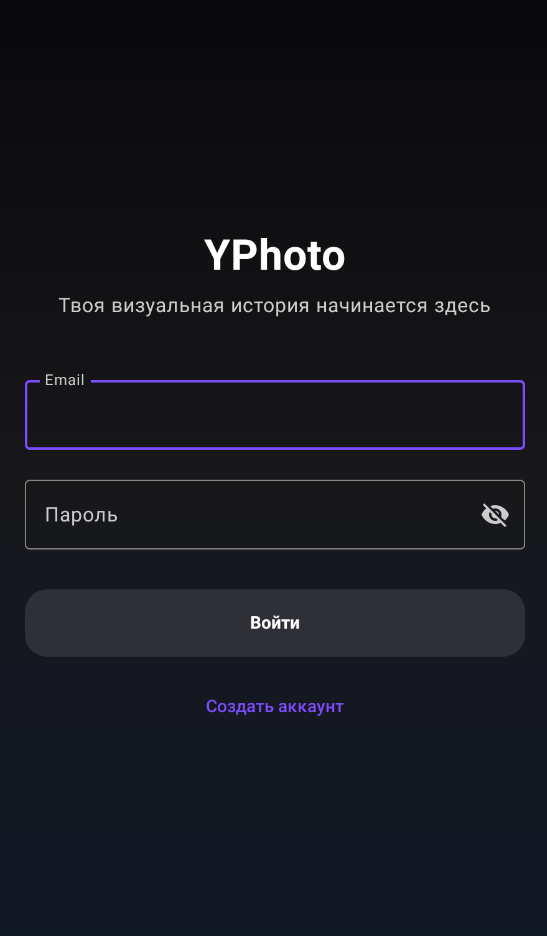
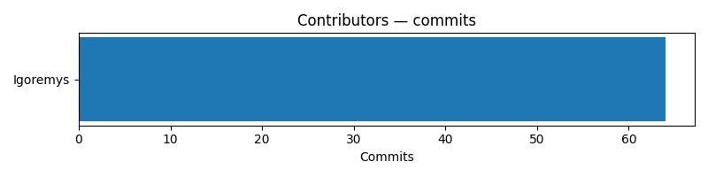
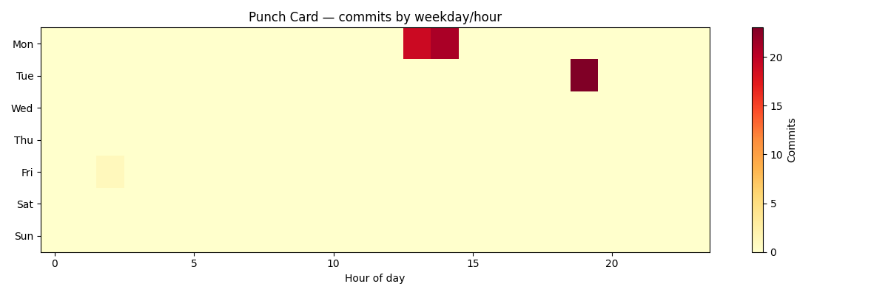

# YPhoto Portfolio

## О проекте

**YPhoto Portfolio** — курсовой проект, состоящий из серверной части на Spring Boot и Android-приложения на Kotlin с Jetpack Compose.

Система реализует клиент-серверную архитектуру и обеспечивает:
- регистрацию и авторизацию пользователей,
- хранение профилей и информации о фотографиях,
- загрузку изображений на сервер,
- просмотр и поиск фото, лайки, редактирование профиля.

## Структура репозитория

```text
PortfolioMuskhazhievCursovayApp/
├── docs/               # Документация 
├── backend/  # Spring Boot backend
├── app/             # Android-приложение
└── README.md           # Основной README проекта
```

## Технологический стек

### Backend
- Java 17
- Spring Boot 3
- Spring Security
- Spring Data JPA
- JWT Authentication
- PostgreSQL
- OpenAPI / Swagger
- JaCoCo
- Gradle

### Mobile
- Kotlin
- Jetpack Compose
- Navigation Compose
- MVVM
- Retrofit
- Room
- Material 3
- Coil

## Основные возможности

### Пользовательский функционал
- регистрация и вход через JWT
- просмотр и редактирование профиля
- поиск пользователей и публичных профилей
- локальный кеш через Room

### Работа с фотографиями
- список всех фотографий
- получение фото по ID
- создание записи фотографии
- загрузка изображений на сервер
- удаление фото
- лайк / дизлайк фото
- просмотр фото автора

### Интерфейс
- адаптивный Material 3 UI
- экраны регистрации, авторизации, галереи, просмотра фото, профиля и поиска
- современный дизайн и удобная навигация

## Архитектура PCMEF

- Presentation (P): `app/src/main/java/com/example/portfolioapp/presentation` — UI-слой мобильного клиента.
- Control (C): `backend/src/main/java/com/portfolioapp/portfoliobackend/controller` — REST-контроллеры.
- Mediator (M): `backend/src/main/java/com/portfolioapp/portfoliobackend/service` — бизнес-логика.
- Entity (E): `backend/src/main/java/com/portfolioapp/portfoliobackend/entity` — доменные модели.
- Foundation (F): `backend/src/main/java/com/portfolioapp/portfoliobackend/repository` и `config` — доступ к данным и настройки безопасности.

## Документация

Вся методическая документация находится в папке `docs/`.
Откройте `docs/README.md` для обзора состава документации и перехода в нужный раздел.

Основные разделы документации:
- `00-project-charter/` — инициирование проекта, бизнес-контекст, цели и задачи.
- `01-requirements/` — требования, сценарии использования, модель предметной области.
- `02-architecture/` — архитектура, интерфейсы, ADR.
- `03-database/` — модель данных, ER-диаграммы, DDL-сценарии.
- `04-design/` — детальное проектирование и диаграммы.
- `05-implementation/` — описание структуры кода и реализации.
- `06-testing/` — план тестирования и результаты.
- `07-refactoring/` — исправления, рефакторинг и code smells.
- `08-ui/` — UI-спецификация и скриншоты.
- `09-api/` — документация REST API.
- `10-deployment/` — развертывание и CI/CD.
- `11-user-guide/` — руководство пользователя.
- `12-final-report/` — финальный отчёт и администрирование.

## Скриншоты

Ключевые экраны приложения (см. `docs/08-ui/screenshots.md`):






## Статистика разработки

Ниже — базовый набор метрик, который полезно показывать в корневом `README.md` для проверки репозитория:


Команды, которые я использовал для сбора метрик локально в клонированном репозитории:

### Графики активности (GitHub)

Ниже приведены автоматически сгенерированные графики на основе истории коммитов:





```bash
git rev-list --count HEAD
git shortlog -sne | sed -n '1,10p'
git log -1 --format='%h %ci'
# Оценка SLOC (если нет cloc):
git ls-files | xargs -r wc -l
```

В проекте уже включены автоматически сгенерированные графики активности GitHub, доступные в `docs/12-final-report/images`.

## Как запустить

### 1. Backend

1. Перейдите в папку backend:
   ```bash
   cd backend
   ```
2. Запустите приложение:
   ```bash
   ./gradlew bootRun
   ```
   На Windows:
   ```bash
   gradlew.bat bootRun
   ```

### 2. Android-приложение

1. Откройте `YPhoto/` в Android Studio.
2. Синхронизируйте Gradle.
3. Запустите модуль `app` на устройстве или эмуляторе.

> Важно: в `YPhoto/app/src/main/java/com/example/portfolioapp/network/RetrofitClient.kt` указан `BASE_URL`.
> Если backend запущен на другом хосте, замените `http://192.168.0.33:8080/api/` на актуальный адрес.

### 3. Тесты backend

```bash
./gradlew test
```

### 4. JaCoCo отчет

```bash
./gradlew jacocoTestReport
```

Отчет будет доступен в:
```text
backend/build/reports/jacocoHtml/index.html
```

## Настройки backend

Основные параметры находятся в `backend/src/main/resources/application.properties`:
- `server.port=8080`
- `spring.datasource.url=jdbc:postgresql://localhost:5432/portfolio_db`
- `spring.datasource.username=postgres`
- `spring.datasource.password=`
- `app.jwt.secret` и `app.jwt.expiration`
- `app.upload.path=${user.dir}/uploads`

## REST API

### Аутентификация
- `POST /api/auth/register`
- `POST /api/auth/login`

### Пользователи
- `GET /api/users`
- `GET /api/users/me`
- `PUT /api/users/profile`
- `GET /api/users/search?keyword={keyword}`
- `GET /api/users/{id}`

### Фотографии
- `GET /api/photos`
- `GET /api/photos/{id}`
- `POST /api/photos`
- `PUT /api/photos/{id}`
- `DELETE /api/photos/{id}`
- `POST /api/photos/{id}/like`
- `GET /api/photos/search?keyword={keyword}`
- `GET /api/photos/by-author?authorId={id}`
- `POST /api/photos/upload`
- `GET /api/photos/files/{filename}`

## Полезная информация

- Swagger UI backend доступен по адресу:
  ```text
  http://localhost:8080/swagger-ui.html
  ```
- API docs:
  ```text
  http://localhost:8080/api-docs
  ```
- Для правильной работы Android-приложения URL backend должен быть доступен из сети, где запускается эмулятор или устройство.

## Ссылки по проекту

- `docs/` — документация
- `backend/README.md` — документация backend
- `/README.md` — документация Android-приложения
- [GitHub репозиторий](https://github.com/Igoremys/PortfolioMuskhazhievCursovayApp.git)
