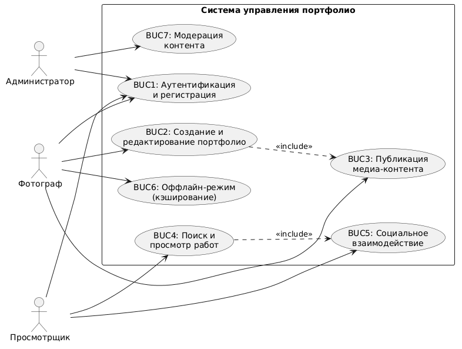

# BUC-диаграмма (Бизнес-прецеденты)

## Описание
Диаграмма BUC отражает высокоуровневые бизнес-процессы системы с точки зрения бизнес-акторов (ролей).

## Бизнес-акторы
1. **Фотограф (Автор):** Основной пользователь, создающий и наполняющий портфолио.
2. **Просмотрщик (Гость/Подписчик):** Пользователь, потребляющий контент.
3. **Администратор:** Модерирует контент и управляет пользователями.

## Список бизнес-прецедентов (BUC)
- **BUC 1:** Аутентификация и регистрация пользователей.
- **BUC 2:** Создание и редактирование личного портфолио.
- **BUC 3:** Публикация и загрузка медиа-контента.
- **BUC 4:** Поиск и просмотр чужих портфолио.
- **BUC 5:** Социальное взаимодействие (лайки, избранное).
- **BUC 6:** Работа в оффлайн-режиме (кэширование).
- **BUC 7:** Модерация контента.

## Диаграмма BUC

