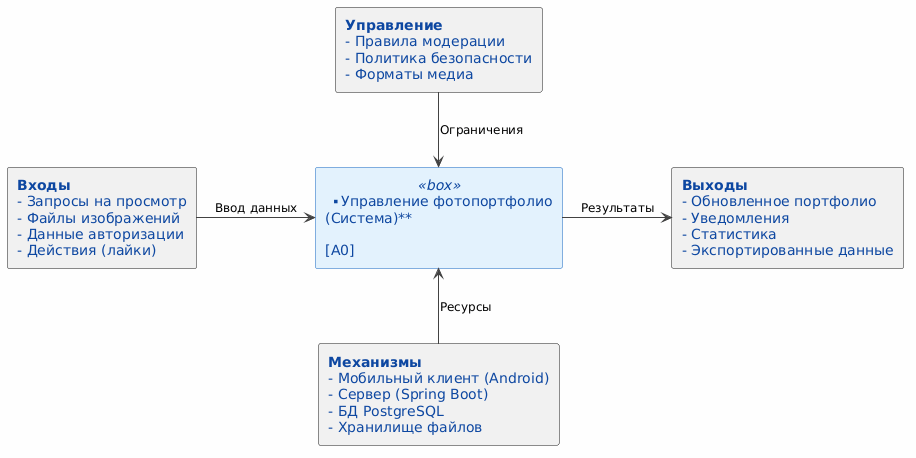

# Диаграмма бизнес-контекста (IDEF0 A-0)

## Описание
Диаграмма IDEF0 уровня A-0 описывает систему "Управление фотопортфолио" как единый процесс в контексте внешних сущностей.

**Входы (Inputs):** Запросы пользователей, исходные файлы фотографий, данные для авторизации.
**Управление (Controls):** Правила модерации контента, политика конфиденциальности (GDPR), требования к форматам изображений.
**Механизмы (Mechanisms):** Мобильное устройство (Android), Сервер приложений (Spring Boot), База данных (PostgreSQL), Хранилище файлов (S3/Local).
**Выходы (Outputs):** Сформированное портфолио, уведомления о лайках, статистика просмотров, экспортированные альбомы.

## Диаграмма IDEF0 A-0

