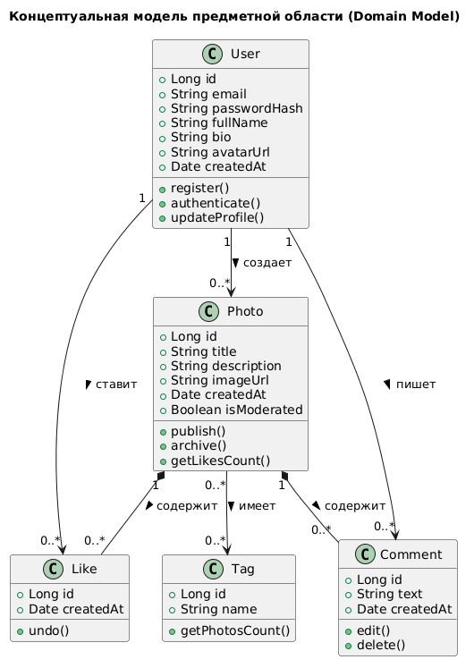

# Domain Model (Концептуальная модель классов)

## Описание
Модель предметной области описывает основные бизнес-сущности системы, их атрибуты и связи без привязки к конкретным технологиям (база данных, язык программирования).

## Основные сущности
1. **User (Пользователь)** — аккаунт в системе.
2. **Photo (Фотография)** — основная единица контента.
3. **Like (Лайк)** — факт взаимодействия пользователя с фото.
4. **Comment (Комментарий)** — текстовый отзыв.
5. **Tag (Тег)** — метка для категоризации.

## Диаграмма Domain Model

