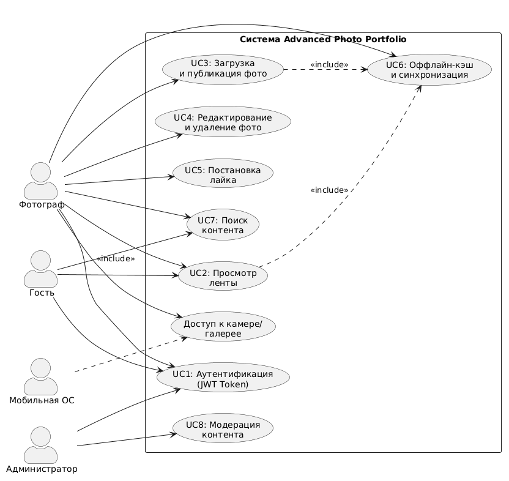

# Диаграмма Use Case (Системные прецеденты)

## Системные акторы
1. **Фотограф (Зарегистрированный пользователь)** — основной актор, управляющий своим портфолио.
2. **Гость (Незарегистрированный пользователь)** — потребляет контент (просмотр, поиск).
3. **Администратор** — управляет пользователями и модерирует контент.
4. **Мобильная ОС (Android OS)** — вторичный актор, предоставляющий доступ к камере, галерее и состоянию сети.

## Системные прецеденты (Use Cases)
- **UC1:** Аутентификация и регистрация (JWT). ✅ Реализовано
- **UC2:** Просмотр ленты фотографий (с пагинацией). ✅ Реализовано (без явной пагинации, загружаются все)
- **UC3:** Загрузка и публикация фото (CRUD: Create). ✅ Реализовано (без очереди при оффлайн)
- **UC4:** Управление своими фото (CRUD: Update/Delete). ⚠️ Реализовано только Delete, Update API есть но нет UI
- **UC5:** Взаимодействие с контентом (Лайки). ✅ Реализовано
- **UC6:** Оффлайн-кэширование и фоновая синхронизация (Room DB). ⚠️ УПРОЩЕННАЯ РЕАЛИЗАЦИЯ (без WorkManager, BroadcastReceiver)
- **UC7:** Поиск фото и пользователей. ✅ Реализовано
- **UC8:** Модерация контента. ❌ НЕ РЕАЛИЗОВАНО

## Диаграмма Use Case

