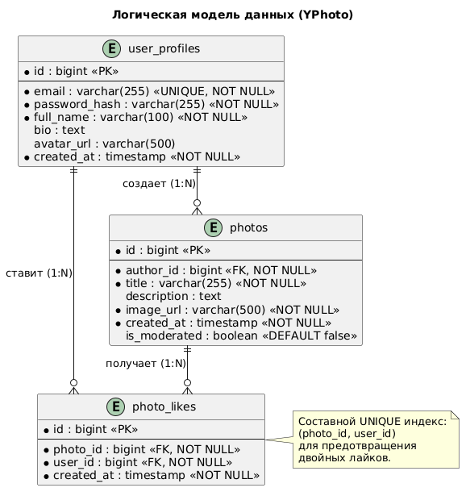

# ER-диаграмма (Логическая модель данных)

## Описание
Диаграмма отображает сущности предметной области, их атрибуты, типы данных, ограничения и связи между ними (1 ко многим, многие ко многим через ассоциативные сущности).

## Диаграмма

