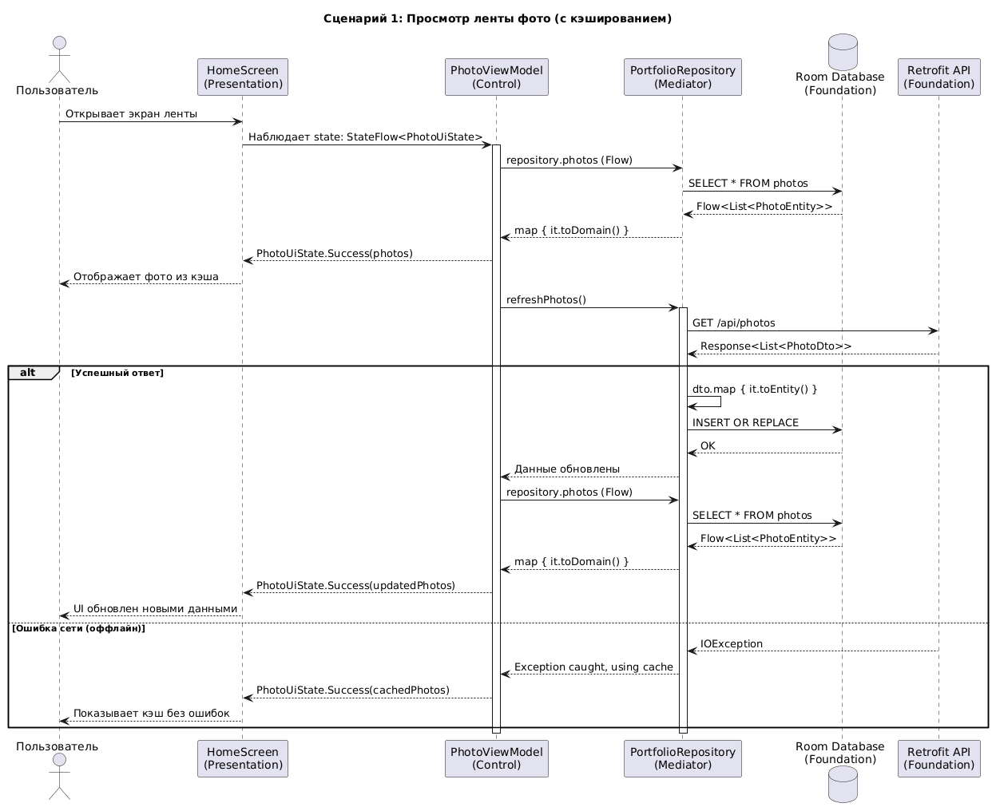
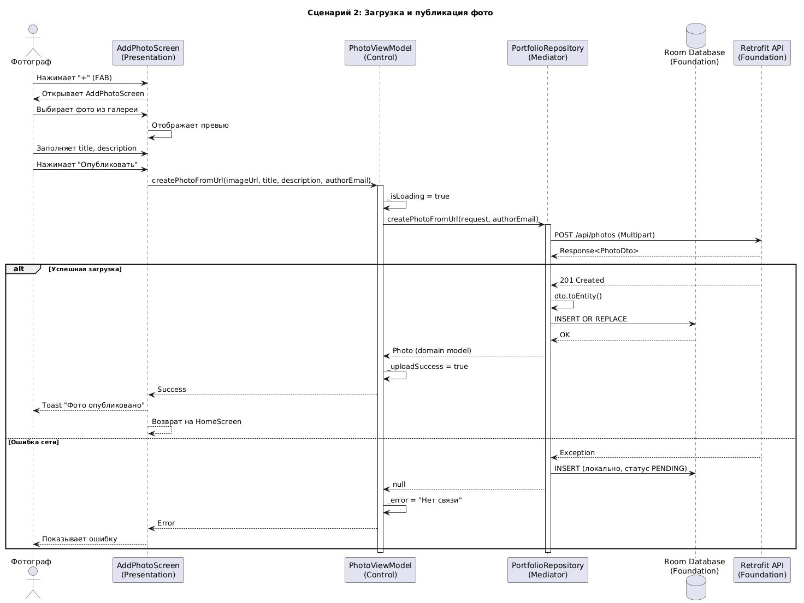
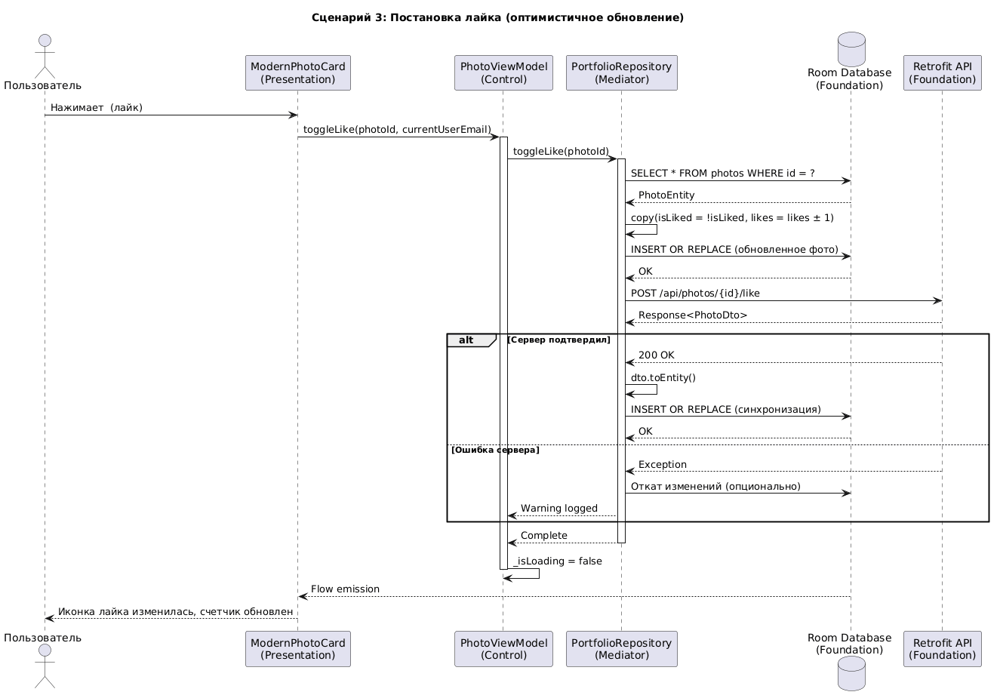
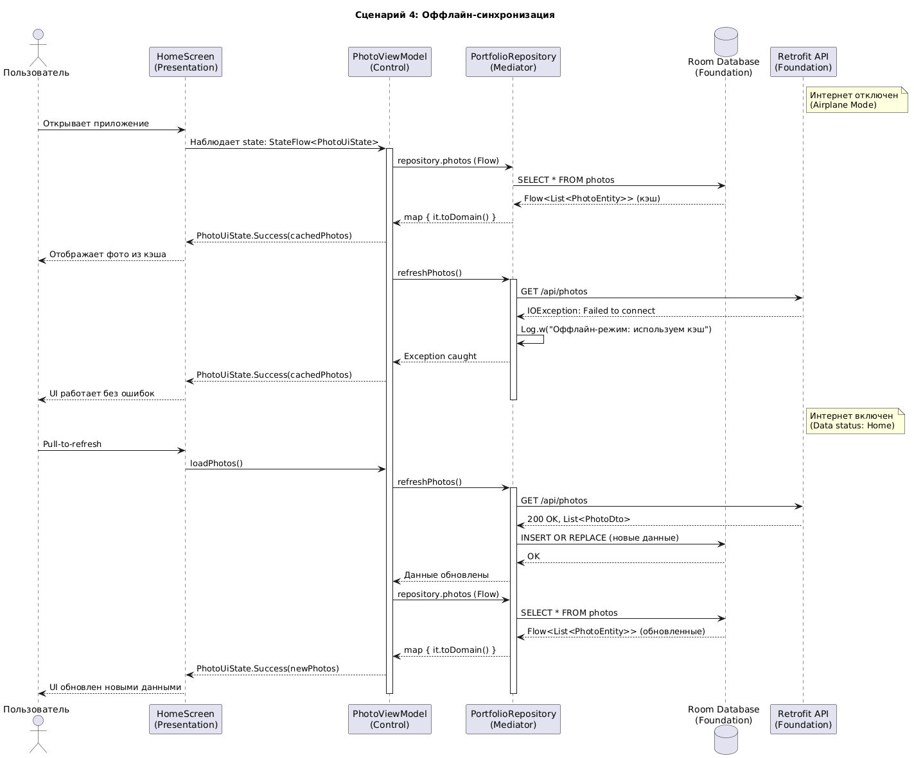

# Диаграммы последовательности (Sequence Diagrams)

## Описание
Диаграммы последовательности показывают взаимодействие между компонентами системы во времени для ключевых сценариев использования.

## Сценарий 1: Просмотр ленты фото (с кэшированием)

Этот сценарий демонстрирует стратегию **Single Source of Truth**: UI всегда получает данные из Room, а Repository в фоне обновляет кэш из сети.

## Сценарий 2: Загрузка и публикация фото

Демонстрирует процесс создания фото: от выбора файла до сохранения в БД и отправки на сервер.

## Сценарий 3: Постановка лайка

Демонстрирует паттерн Optimistic UI Update: UI обновляется мгновенно, не дожидаясь ответа сервера.

Основные шаги сценария:
- пользователь нажимает кнопку лайка на карточке фото;
- ViewModel применяет локальное изменение и смотрит, что состояние UI обновилось сразу;
- Repository отправляет запрос на сервер для записи лайка;
- при успешном ответе синхронизируется локальная копия фото;
- при ошибке серверного ответа производится откат изменения и выводится предупреждение.

## Сценарий 4: Оффлайн-синхронизация

Демонстрирует работу приложения без интернета и последующую синхронизацию при восстановлении связи.

Основные шаги сценария:
- приложение открывается и сразу показывает данные из локального кеша Room;
- ViewModel подписывается на `Flow<List<Photo>>` из репозитория;
- репозиторий пытается получить свежие данные с сервера через API;
- при неудаче (IO исключение) приложение продолжает работать с кешем без ошибки;
- при восстановлении сети новые данные сохраняются в Room и UI автоматически обновляется.

