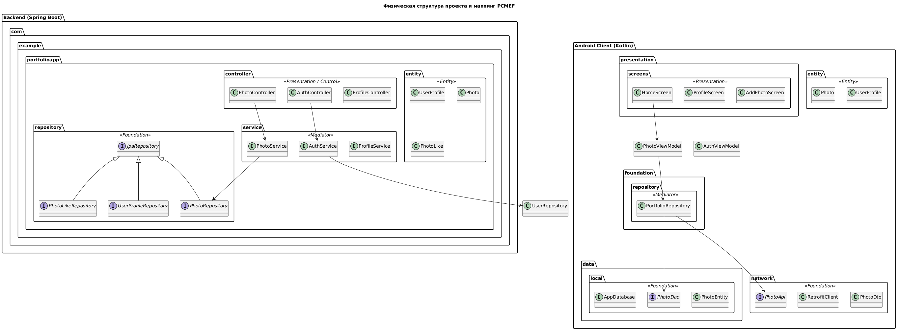

# Структура исходного кода (Code Structure)

## Описание
В данном разделе показано, как логические слои паттерна PCMEF (Presentation, Control, Mediator, Entity, Foundation) отображаются на физическую структуру пакетов в проекте. 

Поскольку проект реализован по Траектории В (Мобильная разработка), структура разделена на **Серверную часть** (Spring Boot) и **Клиентскую часть** (Android Native).

## Диаграмма структуры кода (PCMEF Mapping)



## Android клиент (YPhoto) - детальная структура

```
app/src/main/java/com/example/portfolioapp/
├── presentation/               (PRESENTATION LAYER)
│   ├── screens/
│   │   ├── LoginScreen.kt
│   │   ├── RegisterScreen.kt
│   │   ├── HomeScreen.kt
│   │   ├── PhotoListScreen.kt
│   │   ├── PhotoDetailScreen.kt
│   │   ├── AddPhotoScreen.kt
│   │   ├── ProfileScreen.kt
│   │   ├── PublicProfileScreen.kt
│   │   ├── SearchScreen.kt
│   │   ├── DiscoverProfilesScreen.kt
│   │   └── SettingsScreen.kt
│   └── components/
│
├── viewModel/                  (CONTROL LAYER)
│   ├── PhotoViewModel.kt
│   ├── AuthViewModel.kt
│   ├── SearchViewModel.kt
│   └── UserViewModel.kt
│
├── foundation/                 (FOUNDATION LAYER)
│   ├── repository/             
│   │   └── PortfolioRepository.kt
│   ├── local/
│   │   ├── AppDatabase.kt
│   │   ├── dao/
│   │   │   ├── PhotoDao.kt
│   │   │   └── UserDao.kt
│   │   ├── entity/
│   │   │   ├── PhotoEntity.kt
│   │   │   └── UserEntity.kt 
│   │   └── mapper/
│   │       ├── PhotoMapper.kt
│   │       └── UserMapper.kt
│   └── network/
│       ├── PhotoApi.kt
│       ├── UserApi.kt
│       ├── AuthApi.kt
│       ├── PhotoDto.kt
│       ├── UserDto.kt
│       ├── AuthRequest.kt
│       └── AuthResponse.kt
│
├── entity/                     (ENTITY LAYER)
│   ├── Photo.kt
│   ├── User.kt
│   └── AuthState.kt
│
├── factory/                    (DI)
│   ├── ViewModelFactory.kt
│   └── AppViewModelFactory.kt
│
├── mediator/                   
│   └── AppMediator.kt (deprecated comment)
│
├── control/                   
│
├── MainActivity.kt
├── TestNetwork.kt
└── App.kt
```

## Backend (backend) - структура сервера

```
src/main/java/com/portfolioapp/portfoliobackend/
├── controller/                 (REST endpoints)
│   ├── AuthController.kt
│   ├── UserController.kt
│   └── PhotoController.kt
│
├── service/                    (business logic)
│   ├── AuthService.kt
│   ├── UserService.kt
│   └── PhotoService.kt
│   └── FileUploadService.kt
│
├── dto/                        (data transfer objects)
│   ├── AuthRequest.kt
│   ├── AuthResponse.kt
│   ├── UserDto.kt
│   ├── PhotoDto.kt
│   └── ProfileUpdateRequest.kt
│
├── entity/                     (JPA entities)
│   ├── UserProfile.kt
│   └── Photo.kt
│
├── mapper/                     (entity ↔ DTO mappings)
│   ├── UserMapper.kt
│   └── PhotoMapper.kt
│
├── repository/                 (Spring Data JPA)
│   ├── UserProfileRepository.kt
│   └── PhotoRepository.kt
│
├── security/
│   ├── JwtTokenProvider.kt
│   ├── JwtAuthenticationFilter.kt
│   ├── CustomUserDetailsService.kt
│   └── SecurityConfig.kt
│
├── exception/
│   ├── GlobalExceptionHandler.kt
│   └── ResourceNotFoundException.kt
│
└── PortfolioBackendApplication.kt
```
