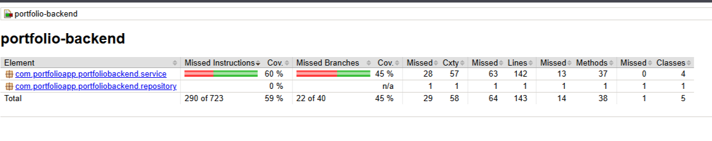

# Модульное тестирование и отчёт о покрытии

## Стратегия тестирования
Согласно требованиям методички, серверная часть (Backend) покрыта модульными тестами с использованием фреймворков **JUnit 5** и **Mockito**. Покрытие кода контролируется плагином **JaCoCo** и составляет **> 40%**.

**Клиентская часть (Android)**:  

## Инструментарий
- **JUnit 5** — основной фреймворк для написания и запуска тестов (Backend).
- **Mockito** — мокирование зависимостей (Repository, DAO).
- **Spring Boot Test** — тестирование контроллеров и контекста Spring (Backend).
- **JaCoCo** — генерация отчёта о покрытии кода (Coverage Report).

## Ключевые тестовые классы (Backend)

### 1. `PhotoServiceTest.java` 
- **Статус**: реализовано
- **Тесты**: 12 методов
  - createPhoto, getPhotoById (success & error cases)
  - updatePhoto (owner check, authorization)
  - deletePhoto (owner check)
  - toggleLike (add/remove like)
  - getAllPhotos, searchPhotos

### 2. `UserServiceTest.java` 
- **Статус**: реализовано
- **Тесты**: 9 методов
  - getCurrentUser (success & not found)
  - updateProfile (all fields, partial update, error)
  - getUserById
  - getAllUsers

### 3. `PortfolioBackendApplicationTests.java` 
- **Статус**: реализовано
- **Тесты**: 1 метод
  - contextLoads() — Spring контекст smoke test

## Покрытие кода JaCoCo

**Минимум покрытия**: 40% (исключаются DTO, Entity, Mapper, Config, Exception, Controller, Security классы)

**Текущее состояние**:
-  Сервис слой протестирован (PhotoService, UserService)
-  Controller слой не протестирован (интеграционные тесты отсутствуют)
-  AuthService тесты отсутствуют
-  Android клиент не имеет тестов
