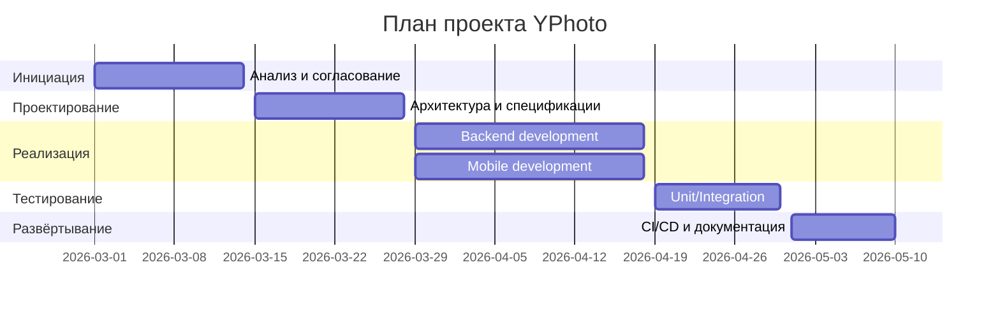

# Диаграмма Ганта

Проект YPhoto разбит на ключевые этапы и временные рамки в формате Gantt. Даты отражают плановую последовательность работ.

Данный Gantt используется как окончательный план этапов разработки и будет включён в итоговую документацию.
